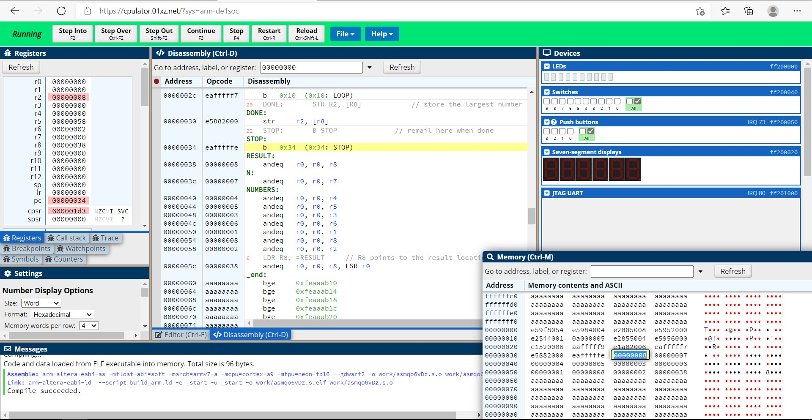

# FPGA-Academic-Computer-Organization-Lab
Trying to do lab programs using CPUlator Computer System Simulator : [click here](https://cpulator.01xz.net/) to try simulator by yourself. 
Lab1 Part2: [Program](ARM/Standard/lab1/part2.s)

