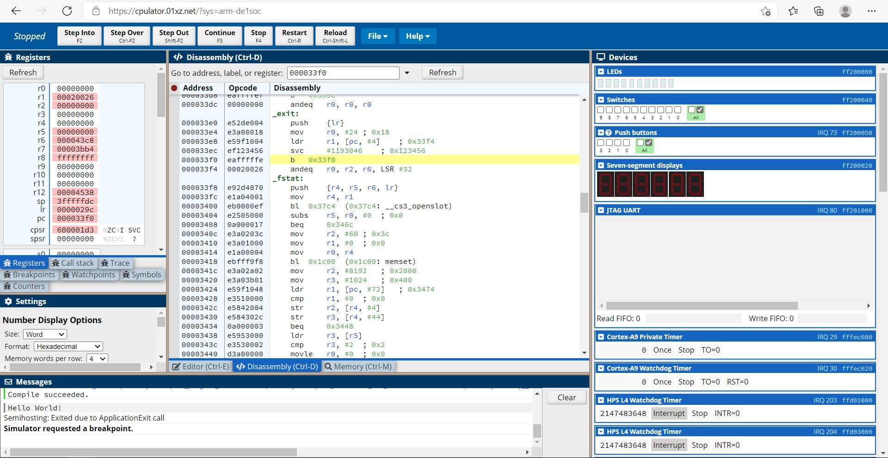
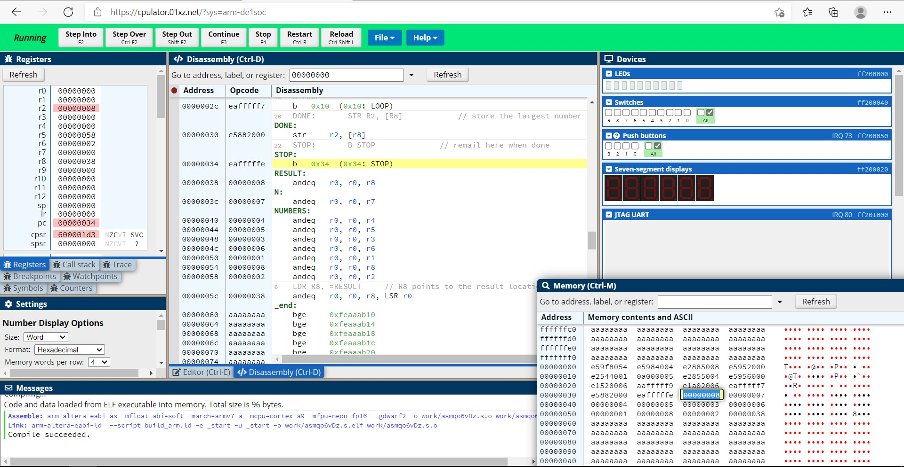
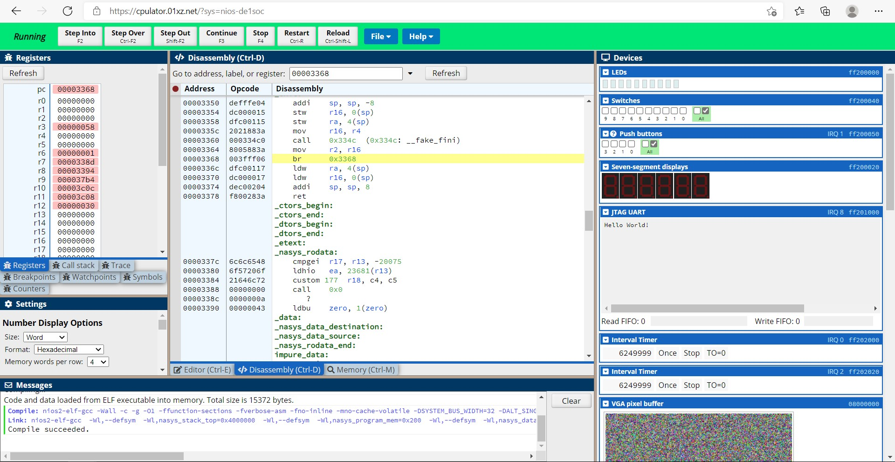
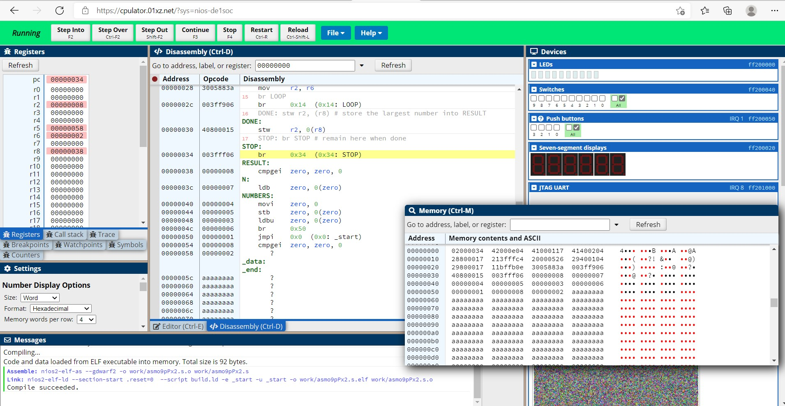

# FPGA-Academic-Computer-Organization-Lab
Trying to do lab programs using CPUlator Computer System Simulator : [click here](https://cpulator.01xz.net/) to try simulator by yourself. 
<h3>ARM</h3>
<h4>Basics</h4>

helloworld:[Program](ARM/Basic/helloworld.c)

<h4>Lab Solutions</h4>

Lab1 Part2: [Program](ARM/Solutions/lab1/part2.s)

<h3>NiosII</h3>
<h4>Basics</h4>

helloworld:[Program](NiosII/Basic/helloworld.c)

<h4>Lab Solutions</h4>

Lab1 Part2: [Program](NiosII/Solutions/lab1/part2.s)

